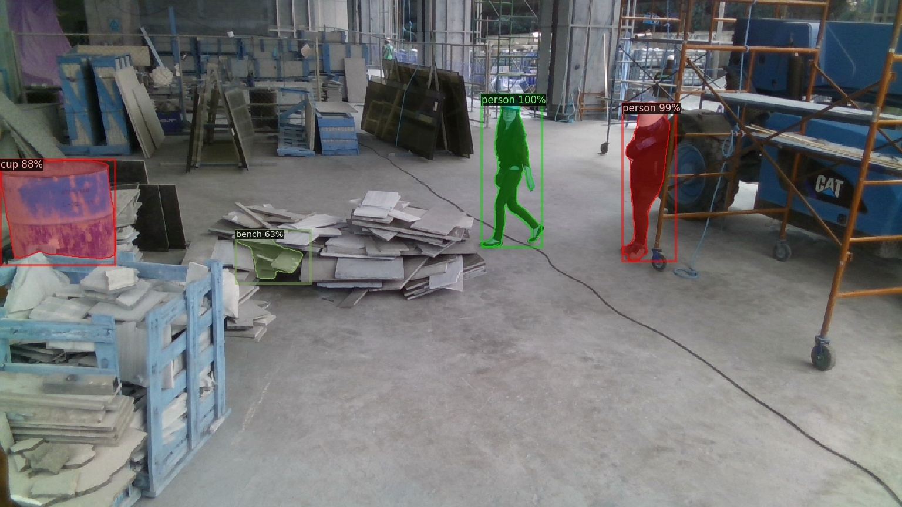

# Silhouette Segmentation Approaches

More up to date and better organized information available on [our notion page](https://www.notion.so/Silhouette-Segmentation-Research-9bef2c8c302248c199b0fea73c872d3c).

The following is a practical comparison of various techniques of segmenting silhouettes/the general foreground from the background. It is intended as cursory research to inform which approach we use for extracting silhouettes for future installations. We will both compare based off specs/ collected data and share sample footage under various conditions. Important factors include: 

- Cost 
- Silhouette quality 
- multiple device support
- Ability to operate robustly under changing lighting conditions
- Range and FOV 
- Ease of development and Installation 
- Ability to deal with a variety lighting conditions

In general we explored two approaches: 

- Depth Camera: Using a depth camera then setting a 3D region of interest to extract the foreground. 
- Camera + Segmentation: Using a camera, depth or other wise, and then applying ML based segmentation to extract the silhouettes/foreground. 

## Depth Cameras

### Data

| Depth Camera          | Price USD | reported Range (M)  | FOV  (H x V) | Low light performance (1-5) | Outdoor performance (1-5) | Outdoor sillhoutte range Meters (good quality - edge) | Multi Camera | Mac | Win | linux | openFrameworks | touchDesigner | Unity  |
|-----------------------|-----------|---------------------|--------------|-----------------------------|---------------------------|-------------------------------------------------------|--------------|-----|-----|-------|----------------|---------------|--------|
| ZED                   | 450       | 0.5 - 20            | 90 x 60      | 1                           | 5                         | 3.3 - 5                                               | Yes          | N   | Y   | Y     | Needs Update   | Y             | Y      |
| Intel RealSense D435i | 199       | 10                  | 87 x 58      | 4                           | 5                         | 4.5 - 8.3                                             | Yes          | Y   | Y   | Y     | Y              | Y             | Y      |
| Azure Kinect DK NFOV  | 400       | 0.5 - 5.46          | 75 x 65      | 5                           | 3                         | 2.7 - 4.1                                             | Supported    | N   | Y   | Y     | NA             | NA            | NA     |
| Azure Kinect DK WFOV  |           | 0.25 - 2.88         | 120 x120     | 5                           | 2                         | 1.5 - 2.1                                             |              |     |     |       |                |               |        |
| Kinect v2             | 280       | 0.7–6               | 70.6 x 60      | 5                           | 1                         | 1.4 - 2.4                                             | Not Easily   | N   | Y   | N     | Y              | Y             | Y      |

### Comparison

Our subjective ranking

| Cost                  | Form Factor           | Low Light             | Indoor Performance    | Outdoor Performance   | Range                 | FOV                   | Ease of Development   |
|-----------------------|-----------------------|-----------------------|-----------------------|-----------------------|-----------------------|-----------------------|-----------------------|
| Intel RealSense D435i | Intel RealSense D435i | Azure Kinect DK       | Azure Kinect DK       | Intel RealSense D435i | Intel RealSense D435i | Azure Kinect DK       | Intel RealSense D435i |
| Kinect v2             | ZED                   | Kinect v2             | Kinect v2             | ZED                   | ZED                   | ZED                   | Kinect v2             |
| Azure Kinect DK       | Kinect v2             | Intel RealSense D435i | ZED                   | Azure Kinect DK       | Azure Kinect DK       | Intel RealSense D435i | ZED                   |
| ZED                   | Azure Kinect DK       | ZED                   | Intel RealSense D435i | Kinect v2             | Kinect v2             | Kinect v2             | Azure Kinect DK       |

### Footage + Notes

Note that you can find more sample footage for each approach in the assets folder.

##### Stereo Zed

Indoor Conditions

Indoor Low Light

Outdoor Close 3.3M

Outdoor Far 5M

**Notes**

- IR cut filter on sensor, if it was possible to remove it would open up more installation possibilities.
- When testing range outside it only extended 10M not the full 20. 
- Has a 3D scanning application in its SDK.
- Tends to merge the background with foreground, Example: if someone is walking close to a surface the surface distorts around the person. 

#### Intel RealSense

Indoor Lights On

Indoor Lights Off

Indoor lowlight

Outdoor Close 4.5 M

Outdoor Far 8.3 M

Sillhouttes extracted with depth Thresholding 

**Notes**

- Stereo cameras do not have an IR cut filter. So stereo is operational in only IR light.
- Provides good usb support and feedback. It says which usb type it is connected  to and continues to work at a lower quality when its connected to usb 2.0. 
- The 3D view provides dramatically less quality than the 2D view. (see above gifs)  
- Lists 1280x800 as an option, but it will not show any depth when that resolution is set.
- Also availble in an outdoor enclosure the Framos [D435e](https://www.framos.com/en/framos-depth-camera-d435e-camera-only-22806), but much more expensive. allows for POE over industrial ethernet connection M12. 

 

Custom casing produced by Antimodular for Speaking Willow project

#### Azure Kinect 

Indoor Wide mode

Indoor Narrow mode

Outdoor Wide mode 2.1M

Outdoor Narrow mode 3.1M

**Notes**

- If it has something in the near field, far field drops/poorly affected. Example: Cannot be sitting in middle of table with table in view, needs to be on the edge of the table
- Provides significantly better range in the "binded" mode.
- The reported range is much smaller than what we observed in testing. In NFOV mode indoors it extended up to 11 meters, but the [specs](https://docs.microsoft.com/en-us/azure/Kinect-dk/hardware-specification) only report a range up to 5.46 meters in NFOV mode. 

#### Kinect v2

Indoor 

Outdoor 2.4M

**Notes**

- Discontinued support 
- A lot of harware accessories
- plug and play installation 

## Camera + Segmentation   

Overall the advantage of this technique is that it cuts out the work of manually cutting out the background through a region of interest and provides potentially useful additional information like the 3D skeleton, unique IDs for each person in the scene. It will also only mask people and will ignore all other backround objects. The disadvantages include: limited ranges, inability to track from certain angles, higher required specs to perform well. 

### Data

| Approach                        | Range M | Sillhoutte Quality (1-5 best) | Skeleton Quality (1-5) | Angle (1-5) |
|---------------------------------|---------|-------------------------------|------------------------|-------------|
| Azure Kinect+ body tracking SDK | 7       | 3                             | 5                      | 3           |
| BodyPix 2                       | 6.7     | 1                             | 0                      | 4           |
| Kinect v2 + body tracking SDK   | 4.2     | 0                             | 3                      | 2           |
| Oak-D + Segmentation     | --       | ---                          | ---                  | ---         |
| Nvidia Broadcast Engine    | --       | --                            | --                    | --          |
| Detectron    | --       | 5                            | --                    | --          |

### Footage + Notes

#### Intel RealSense + NuiTrack

Distance 

Occlusion

Angle

**Notes**

- They threshold the depth data at 4M in the example. Is it possible to increase that threshold through their API?  
- As of writing, there is no support for [multiple sensors](https://community.nuitrack.com/t/adding-multiple-cameras-to-nuitrack/991/11). 

#### Azure Kinect + body Track SDK 

Distance 

Occlusion

Angle

**Notes**

- Tracking range and persistence is impressive.
- Less false skeletons than earlier kinect.
- Example only available in NFOV mode and not available in wide mode. Tracking range would decrease in wide mode. 
- While the skeleton information is robust the silhouette segmentation is patchy.
- Requires high specs to run the tracking sdk. 

#### Kinect 2 + body Track SDK

Distance 

Occlusion 

 
Angle 

**Notes**

- No silhouette segmentation available. 
- frequent false positives.

#### Oak-D 

Angle 

**Notes**

- See full testing [here](https://www.notion.so/Oak-D-Testing-9703b1a764e8483c8b381e1e4691a585)
- Limited FOV depending on the model used 
- Offloads processing to the device iself rather than on the computer 
- Many models available through openVINO
- Segmentation tested with deeplabv3p_person model

#### BodyPix 2

Multiperson RGB

ResNet50, internalResolution full, output stride 32. (full settings [here](Assets/bodyPix2/clips/bodyPix-RGB-MultiPerson-translucent2.mov))

Multiperson RGB Masked

(full settings [here](Assets/bodyPix2/clips/bodyPix-RGB-MultiPerson-opaque.mov))

Multiperson IR 

(full settings [here](Assets/bodyPix2/clips/bodyPix-IR-MultiPerson-translucent.mov))
Simulate night conditions with IR illumination 

Multiperson IR Opaque

(full settings [here](Assets/bodyPix2/clips/bodyPix-IR-MultiPerson-opaque.mov))

Angle

**Notes**

- Ran test on Windows 10 (3.6 GHz, 32GB of Ram, GeForce RTX 2080)
- Performed much better under with IR only light than the Nvidia Broadcast Engine
- Tested with Google's Coral USB Accelerator for running bodypix locally ([link to test](Assets/bodyPix2/gifs/coralReference4.gif)). As of writing this it was challenging to set up and [no automatic smoothing](https://github.com/google-coral/project-bodypix/issues/5) available. 

#### Nvidia Broadcast Engine

Multiperson RGB

Multiperson RGB Masked 

Multiperson IR

Single person IR Masked

**Notes**

- Ran test on Windows 10 (3.6 GHz, 32GB of Ram, GeForce RTX 2080)
- Very easy to install and use when the very high specs are met.  
- The intended purpose is to mask out gamers as they are streaming. Definitely using this outside of its intended purpose- in IR light only and at a greater distance. 

### Detectron 

| rcnn                    | PointRend|
|---------------------------------|---------|
| | |
| | |
| | |
| | |
| | |
| | |   

## Other Possibilities  

This isn't an exhaustive list. Here are some of the other promising possibilities.

- [OpenCV BackgroundSubtractorMOG](https://docs.opencv.org/3.3.0/db/d5c/tutorial_py_bg_subtraction.html) - traditional rgb camera with no ML. Requires calibration when the scene changes. 
- [foreground extraction - FgSegNet_v2](https://github.com/lim-anggun/FgSegNet_v2) - ML approach with an RGB camera. Would need high specs for a good fps and resolution.
- [maskrcnn-benchmark](https://github.com/facebookresearch/maskrcnn-benchmark/issues/42) - ML approach on RGB camera. Only masks and not labels would be necessary. Looks like it has a max of 10 fps for realtime performance. 
- [VideoPose3D](https://github.com/facebookresearch/VideoPose3D) - Doesn't provide silhouettes and not intended for realtime. 
- [arkit IOS](https://developer.apple.com/documentation/arkit/arbody2d) - Only available in IOS
- [Detectron realtime](https://github.com/cedrickchee/realtime-detectron) - FPS is still low for realtime

