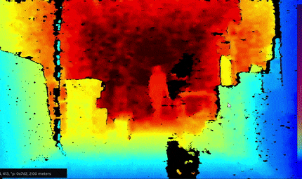

# Silhouette Segmentation Approaches

The following is a practical comparison of various techniques of segmenting silhouettes/the general foreground from the background. It is intended as cursory research to inform which approach we use for extracting silhouettes for future installations. We will both compare based off specs/ collected data and share sample footage under various conditions. Important factors include: 

- Cost 
- Silhouette quality 
- multiple device support
- Ability to operate robustly under changing lighting conditions
- Range and FOV 
- Ease of development and Installation 
- Ability to deal with a variety lighting conditions

In general we explored two approaches: 

- Depth Camera: Using a depth camera then setting a 3D region of interest to extract the foreground. 
- Camera + Segmentation: Using a camera, depth or other wise, and then applying ML based segmentation to extract the silhouettes/foreground. 

## Depth Cameras

### Data

| Depth Camera          | Price USD | reported Range (M)  | FOV  (H x V) | Low light performance (1-5) | Outdoor performance (1-5) | Outdoor sillhoutte range Meters (good quality - edge) | Multi Camera | Mac | Win | linux | openFrameworks | touchDesigner | Unity  |
|-----------------------|-----------|---------------------|--------------|-----------------------------|---------------------------|-------------------------------------------------------|--------------|-----|-----|-------|----------------|---------------|--------|
| ZED                   | 450       | 0.5 - 20            | 90 x 60      | 1                           | 5                         | 3.3 - 5                                               | Yes          | N   | Y   | Y     | Needs Update   | Y             | Y      |
| Intel RealSense D435i | 199       | 10                  | 87 x 58      | 4                           | 5                         | 4.5 - 8.3                                             | Yes          | Y   | Y   | Y     | Y              | Y             | Y      |
| Azure Kinect DK NFOV  | 400       | 0.5 - 5.46          | 75 x 65      | 5                           | 3                         | 2.7 - 4.1                                             | Supported    | N   | Y   | Y     | NA             | NA            | NA     |
| Azure Kinect DK WFOV  |           | 0.25 - 2.88         | 120 x120     | 5                           | 2                         | 1.5 - 2.1                                             |              |     |     |       |                |               |        |
| Kinect v2             | 280       | 0.7–6               | 57 x 43      | 5                           | 1                         | 1.4 - 2.4                                             | Not Easily   | N   | Y   | N     | Y              | Y             | Y      |

### Comparison

Our subjective ranking

| Cost                  | Form Factor           | Low Light             | Indoor Performance    | Outdoor Performance   | Range                 | FOV                   | Ease of Development   |
|-----------------------|-----------------------|-----------------------|-----------------------|-----------------------|-----------------------|-----------------------|-----------------------|
| Intel RealSense D435i | Intel RealSense D435i | Azure Kinect DK       | Azure Kinect DK       | Intel RealSense D435i | Intel RealSense D435i | Azure Kinect DK       | Intel RealSense D435i |
| Kinect v2             | ZED                   | Kinect v2             | Kinect v2             | ZED                   | ZED                   | ZED                   | Kinect v2             |
| Azure Kinect DK       | Kinect v2             | Intel RealSense D435i | ZED                   | Azure Kinect DK       | Azure Kinect DK       | Intel RealSense D435i | ZED                   |
| ZED                   | Azure Kinect DK       | ZED                   | Intel RealSense D435i | Kinect v2             | Kinect v2             | Kinect v2             | Azure Kinect DK       |

### Footage + Notes

Note that you can find more sample footage for each approach in the assets folder.

##### Stereo Zed

Indoor Conditions

Indoor Low Light

Outdoor Close 3.3M

Outdoor Far 5M

**notes**

- IR cut filter on sensor, if it was possible to remove it would open up more installation possibilities.
- When testing range outside it only extended 10M not the full 20. 
- Has a 3D scanning application in its SDK.
- Tends to merge the background with foreground, Example: if someone is walking close to a surface the surface distorts around the person. 

#### Intel RealSense

Indoor Lights On

Indoor Lights Off

Indoor lowlight

Outdoor Close 4.5 M

Outdoor Far 8.3 M

**notes**

- Stereo cameras do not have an IR cut filter. So stereo is operational in only IR light.
- Provides good usb support and feedback. It says which usb type it is connected  to and continues to work at a lower quality when its connected to usb 2.0. 
- The 3D view provides dramatically less quality than the 2D view. (see above gifs)  
- Lists 1280x800 as an option, but it will not show any depth when that resolution is set.
 

#### Azure Kinect 

Indoor Wide mode

Indoor Narrow mode

Outdoor Wide mode 2.1M

Outdoor Narrow mode 3.1M

**notes**

- If it has something in the near field, far field drops/poorly affected. Example: Cannot be sitting in middle of table with table in view, needs to be on the edge of the table
- Provides significantly better range in the "binded" mode.
- The reported range is much smaller than what we observed in testing. In NFOV mode indoors it extended up to 11 meters, but the [specs](https://docs.microsoft.com/en-us/azure/Kinect-dk/hardware-specification) only report a range up to 5.46 meters in NFOV mode. 

#### Kinect v2

Indoor 

Outdoor 2.4M

**notes**

- Discontinued support 
- A lot of harware accessories
- plug and play installation 

